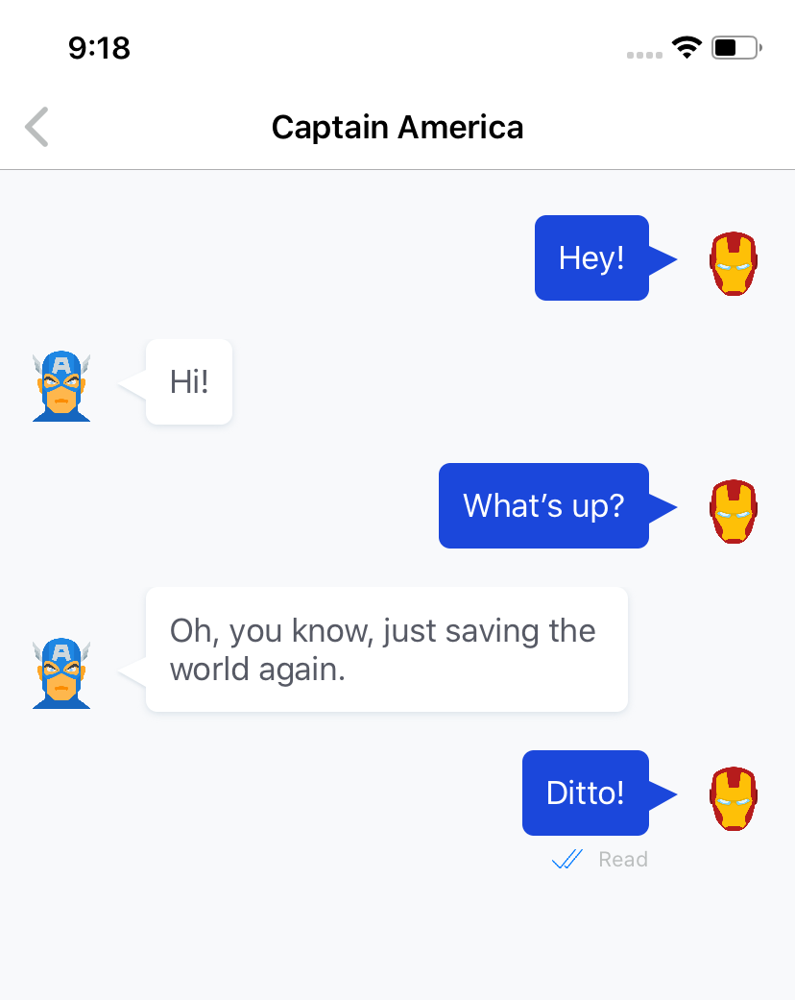

# iOS Chat App With Read Receipts

Read the full tutorial here:

[**>> Adding Read Receipts to your iOS Chat App**](https://www.cometchat.com/tutorials/)

This example shows how to build a one-to-one chat app with read receipts in Swift:

## Technology

This demo uses:

* CometChatPro 2.0.8-Xcode11.4
* Swift 5
* Xcode 11.4

## Running the demo

To run the demo follow these steps:

1. [Head to CometChat Pro and create an account](https://cometchat.com/pro?utm_source=github&utm_medium=example-code-readme).
2. From the [dashboard](https://app.cometchat.com/?utm_source=github&utm_medium=example-code-readme), create a new app called "CometChat" in **USA**.
3. Once created, click on the app.
4. Download the repository [here](https://github.com/marinbenc/cometchat-ios-read-receipts/archive/master.zip) or by cloning `https://github.com/marinbenc/cometchat-ios-read-receipts.git`.
5. Navigate to project directory and use `pod install` command to install the pods and open **CometChat.xcworkspace** in Xcode.
6 Update the `Constants` in [ChatService.swift](https://github.com/marinbenc/cometchat-ios-push-notifications/blob/master/CometChat/CometChat/Model/ChatService.swift) with your app ID, API key (auth key) and Region code which you can find in your CometChat app's dashboard.
7. Run the app and login with one of the test users: superhero1, superhero2, superhero3, superhero4 or superhero5.

Questions about running the demo? [Open an issue](https://github.com/marinbenc/cometchat-ios-read-receipts/issues). We're here to help ✌️

## Useful links

- 🏠 [CometChat Homepage](https://cometchat.com/pro?utm_source=github&utm_medium=example-code-readme)
- 🚀 [Create your free account](https://app.cometchat.com?utm_source=github&utm_medium=example-code-readme)
- 📚 [Documentation](https://prodocs.cometchat.com/docs?utm_source=github&utm_medium=example-code-readme)
- 👾 [GitHub](https://github.com/CometChat-Pro)

